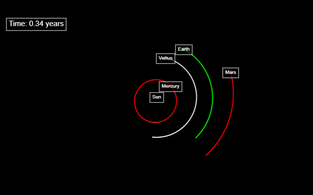

# Gravity-simulator


A newtonian brute force gravity simulator of the solar system written in Python/Vpython. It is probably not too accurate so don't plan your rocket launch using it. It can be fun though to play around making your own solar systems (or throwing in a black hole in our own).

# Prerequisites
- Python 3 (sorry legacy python)
- You must have VPython installed on your system if you want to run the GUI. To install it, run this command:

``pip install vpython``

# Usage
To run the default configuration (dt=0.01, integrator=euler, infinite loop, the sun and 9 planets + some surprises) run ``python gravity.py`` to run the simulation. It will open up a browser window and it will show the simulation there. To stop the simulation you close the browser tab, CTRL-C does not work. You can navigate the scene with these controls:
- Zoom: scroll while your mouse pointer is above the simulation window.
- Pan: SHIFT + LEFT MOUSE BUTTON.
- Rotate: hold RIGHT MOUSE BUTTON
- Resize window: drag in the lower left corner of the simulation. 

You can also run the simulation in a headless mode ie. no gui. To use headless mode you run ``python headless.py``. It has the same arguments as ``gravity.py``. In my benchmarking it was around 20-30% faster than the gui version. 

## Options
There are multiple command line arguments you can pass to the simulation:
- `-t` or `--time`, the length of the simulation measured in days. If it is set to ``0`` it will go on forever. Default: 0.
- `--dt`, the timestep the simulation will use measured in days. Default: 0.1.
- `--scale`, to make the simulation look better you can scale all planets with the property `"scale" = true` by a scale factor you specify here. Default: 1000.
- `--rate`, the maximum amount of timesteps per second. Default: 100000.
- `--configfile`, the path to the json file containing your configurations. Default: ``config.json``.
- `--useconfig`, if this is checked then the settings in your configuration file will be used over those you pass in the command line. Not checked by default.
- `--integrator`, the integrator you want to use. Default: ``"verlet"``. You're options are: ``"euler"``,``"verlet"``,``"rk4"``,``"fr"``,``"pefrl"``.
- `--endPos`, prints the end position of all planets if checked. Not checked by default.
- `--checkEndPos`, when simulation is ended, compare the end positions of all bodies with their ``"end_position"`` in the configuration file and prints both the individual error and the sum. Used for measuring accuracy of integrators. 

## Units
The units used in the simulation is Astronomical Units (AU) for length, Solar masses (M☉) for mass and Days for time. 

## config.json
The config.json file (you can choose another name if you like) is where you store the initial position, initial velocities, mass, name etc of your planets and bodies and optionally parameters for the simulation which can be used by adding ``--useconfig`` to the run-command. It is structured like this:

``` javascript
[
    [
        // list of planet objects 
        {
            "name": "Earth",
            "mass": 3.04043263333e-6,
            "gm": 8.997011390199872e-10,
            "radius": 4.247333333333333e-05,
            "position": [4.917017576275505E-01, -8.824042530509359E-01, -5.209443792483747E-05],
            "end_position":[4.850668307591792E-01, -8.839011585264035E-01, 2.533899203374515E-05],
            "velocity": [1.477301441290793E-02, 8.256590272640510E-03, -2.300568124497324E-07],
            "color": [0, 255, 0],
            "trail": true,
            "scale": true,
            "comet": false
        },
        {
            "name": "Mercury",
            "mass": 0.16601e-6,
            "gm": 4.912480450364760e-11,
            "radius": 4e-05,
            "position": [-6.697949577695279E-02, -4.533786004323493E-01, -3.151845929929386E-02],
            "end_position":[2.128557880267996E-01, -3.694820309779729E-01, -5.057699121768672E-02],
            "velocity": [2.218564484463378E-02, -2.645629962873034E-03, -2.252238212508237E-03],
            "color": [255, 0, 0],
            "trail": true,
            "scale": true,
            "comet": false
        }
        // more planets here
    ],
    [
        "dt": 0.01,
        "integrator": "verlet"
        // more settings here
    ]
]
```

#### Planets
Every planet is configured in ``config.json`` by default. The current attributes that a planet has is:
- ``name`` - the name that will be displayed over the planet.
- ``mass`` - the mass of the planet measured in solar masses.
- ``radius`` - the radius of the planet measured in AU.
- ``position`` - the initial position vector. It is a 3D-vector and is given as a array/list: [x, y, z].
- ``velocity`` - the initial velocity vector. It is a 3D-vector and is given as a array/list: [x, y, z].
- ``end_position`` - used for benchmarking. Is the actual position of the planet when the simulation has ended.  
- ``color`` - the color the planet and its trail will have. Given as a array/list of RGB values in the range(0, 255): [red, blue, green].
- ``trail`` - set to ``true`` if the planet should show a trail after itself. If not set to ``false``.
- ``scale`` - set to ``true`` if you want to scale the visual radius (the one used in calculations is still the same as ``radius``) of the planet by ``scale_factor`` to make it easier to see. For big planets (eg the sun in a solar system) set it to ``false``.
- ``comet`` - if set to ``true`` the planet will not affect the other planets with any gravitational force. It itself will be affected by every body that has this property set to ``false``. Setting this to ``true`` is good when the planet is very lightweight compared to the other planets because it will speed up the simulation speed. 

#### Simulation Settings
If you want to share your simulation with someone else to let them run it on their computers it is handy to set your simulation settings in your ``config.json`` file because then all you have to do is to send them this file and they are ready to go. By default it is turned off, to use it, add ``--useconfig`` to your run-command like this: ``python gravity.py --useconfig``. Settings in your ``config.json`` file will have higher priority than those you pass through the command line. 


## Integrators
TODO

## Benchmark
The benchmark was done with this command (change {dt} and {integrator} with all the combinations you want to test):

``python headless.py -t 365 --configfile 22-07-2018-365-days.json --checkEndPos --dt {dt} --integrator {integrator}``

This will test how accurate the simulation is when it simulates one year (365 days). The data in the json file is from [Horizons](https://ssd.jpl.nasa.gov/horizons.cgi#top). 

Note: for this to work you must set the property ``endPos`` for the planets you want to benchmark in your config.json file. 

### Results
| T = 365 Days | integrator    |               |                |               |               |
|--------------|---------------|---------------|----------------|---------------|---------------|
| dt           | euler         | verlet        | rk4            | fr            | pefrl         |
| 10           | 1,47476219077 | 1,51285184129 | 39,14386323373 | 1,14509990477 | 0,54122193722 |
| 5            | 0,79499239136 | 0,41222294662 | 12,60597127155 | 0,12479212873 | 0,00493978032 |
| 2            | 0,24397024003 | 0,16658838425 | 6,48772249431  | 0,09844171931 | 0,09395267074 |
| 1            | 0,09101448696 | 0,01847137514 | 3,45951631113  | 0,00030737638 | 0,00000883167 |
| 0,1          | 0,00755360321 | 0,00018533487 | 0,34543910869  | 0,00000172775 | 0,00000175356 |
| 0,01         | 0,00074768069 | 0,00000228638 | 0,03439155278  | 0,00000175423 | 0,00000175423 |

dt is the timestep measured in days and the numbers under the integrators are the total summed error between the simulated positions of the planets at the end of the simulation and the actual position gathered from [Horizons](https://ssd.jpl.nasa.gov/horizons.cgi#top).

# Compability
- Windows 64-bit: Working :-)
- Linux/Mac: hopefully working (file an issue whether it works or not)

# TODO
- Finish documentation
- Benchmark: compare execution time
- Add option to save positions and velocities to csv every n:th timestep
- Collisions maybe (at least with the sun to avoid slingshots)
- Implement Barnes Hut for improved speed
- Refactor code to be more modular and changeable

## Contribution
Feel free to submit pull request for improvements or additions. It makes it easier if you open an Issue first so we can discuss a good implementation of your feature.
Add your name to the ``CONTRIBUTORS.md`` file. Your name and what you added. 
